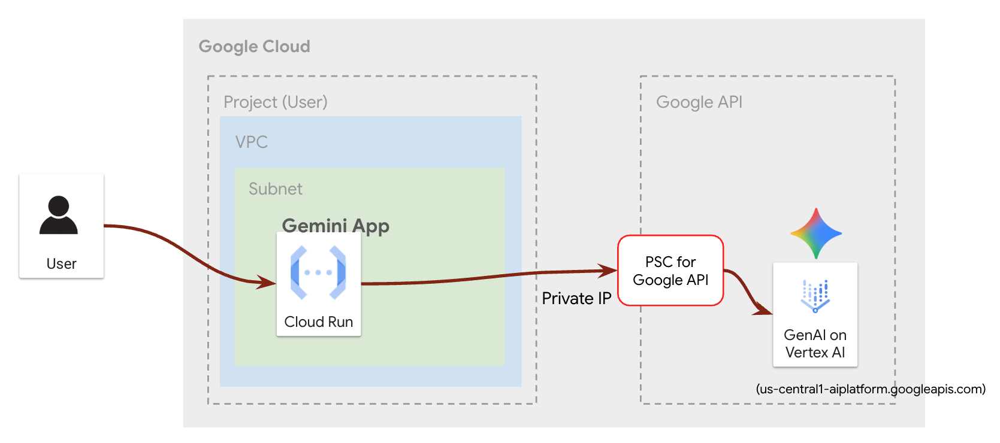
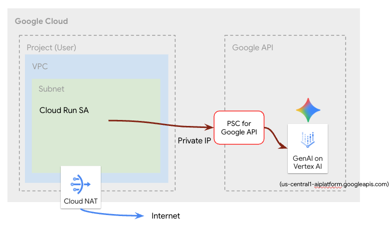

# AI Applications on Cloud Run

This repository contains a collection of AI-powered applications and services designed to run on **Google Cloud Run**. Each sub-project performs an independent function. For more details, please refer to the `README.md` file for each project.

## Project Structure

*   **[terraform](./terraform/)**: Contains all the Terraform scripts for provisioning the Google Cloud infrastructure for the projects. This setup ensures secure access to Gemini from Cloud Run via Private Service Connect (PSC).

*   **[ai-agent](./ai-agent/README.md)**: A Zoo Tour Guide AI Agent that utilizes an MCP Server deployed on Cloud Run.
    <BR>
    

*   **[gemini-app](./gemini-app/README.md)**: A web application that provides movie recommendations using Google's Gemini model.
    <BR>
    
   


## Installation

1.  **Set up environment variables:**

    The following instructions assume you start from the root of the `run-ai-apps` directory.

    ```bash
    cd ~/run-ai-apps/terraform

    export PROJECT_ID=<your-gcp-project-id>
    export REGION=us-central1
    ```

2.  **Update `terraform.tfvars`:**

    ```bash
    sed -i \
    -e "s/your-gcp-project-id/$PROJECT_ID/" \
    -e "s/your-region/$REGION/" \
    terraform.tfvars
    ```

3.  **Initialize and apply Terraform:**

    ```bash
    terraform init
    terraform plan
    terraform apply --auto-approve
    ```

    Take note of the outputs for Copy
    ```
    Outputs:

    network_name = "run-ai-apps-network"
    subnetwork_name = "run-ai-apps-subnet"
    service_account_account_id = "run-ai-apps-sa"
    ```

4.  **Set up environment variables from terraform output**

    ```bash   
    cd ~/run-ai-apps

    export NETWORK_NAME=run-ai-apps-network
    export SUBNET_NAME=run-ai-apps-subnet
    export SERVICE_ACCOUNT=run-ai-apps-sa
    ```


## Terraform Resources

The Terraform scripts in the `terraform` directory create the following Google Cloud resources:

-   **`google_project_service`**: Enables necessary Google Cloud APIs for the project, including Cloud Run, Vertex AI, Cloud DNS, Service Directory, Cloud Build, and Artifact Registry.
-   **`google_service_account`**: Creates a dedicated service account (`run-ai-apps-sa`) for the Cloud Run services to interact with other Google Cloud services securely.
-   **`google_project_iam_member`**: Assigns necessary IAM roles to the service account, such as `roles/aiplatform.user` and `roles/run.invoker`, allowing it to interact with other Google Cloud services.
-   **`google_compute_network`**: Creates a custom Virtual Private Cloud (VPC) network (`run-ai-apps-network`) to provide a secure and isolated environment for the services.
-   **`google_compute_subnetwork`**: Creates a subnetwork (`run-ai-apps-subnet`) within the VPC.
-   **`google_compute_router`**: Creates a Cloud Router to manage dynamic routing for the VPC network.
-   **`google_compute_router_nat`**: Creates a Cloud NAT gateway to allow instances without external IP addresses to access the internet.
-   **`google_compute_global_address`**: Reserves a global internal IP address for Private Service Connect (PSC) to enable private access to Google APIs.
-   **`google_compute_global_forwarding_rule`**: Creates a forwarding rule to direct traffic from the reserved IP address to Google APIs via PSC.
-   **`google_dns_managed_zone`**: Creates a private DNS zone for `googleapis.com` to resolve Google API domain names to the PSC endpoint.
-   **`google_dns_record_set`**: Creates DNS records within the private zone to point to the PSC endpoint.
    <BR><BR>

## Deployment
After provisioning the infrastructure, navigate to the directory of the application you wish to deploy and follow the instructions in its respective `README.md` file.

*   **[ai-agent](./ai-agent/README.md)**: A sophisticated AI agent that acts as a "Zoo Tour Guide," leveraging a custom MCP server and Wikipedia for information.    
*   **[gemini-app](./gemini-app/README.md)**: A web application that provides movie recommendations using Google's Gemini model.
    
## Reference
* [Using Private Service Connect for Google APIs to Access Gemini over a Hybrid Connection](https://codelabs.developers.google.com/cloudnet-psc-hybridGemini?hl=en#10)
