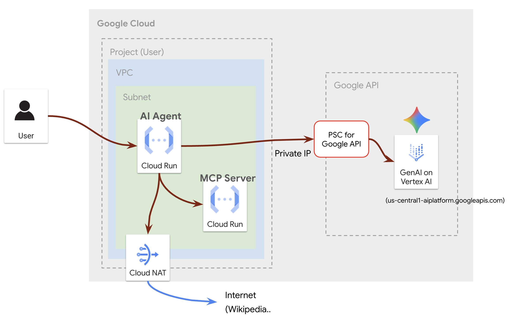

# AI Agent Infrastructure Setup

## Overview

This project provides a comprehensive setup for deploying a sophisticated AI agent on Google Cloud. The agent is designed to be a "Zoo Tour Guide," capable of answering questions about animals in a fictional zoo. It leverages a custom-built MCP (Multi-turn Conversation Platform) server for zoo-specific data and Wikipedia for general knowledge. The entire infrastructure is managed using Terraform, and the agent is deployed on Cloud Run.



## Getting Started

### Prerequisites

- [Google Agent Development Kit](https://google.github.io/adk-docs/)
- You must complete the infrastructure setup with Terraform before proceeding with the deployment steps below.

### Application Deployment to Cloud Run

1.  **Set up environment variables from Terraform output:**

    ```bash
    cd ./ai-agent

    export PROJECT_ID=<your-gcp-project-id>
    export REGION=us-central1

    export PROJECT_NUMBER=$(gcloud projects describe $PROJECT_ID --format="value(projectNumber)")
    export UserName=<your-gcp-project-id>

    export NETWORK_NAME=run-ai-apps-network
    export SUBNET_NAME=run-ai-apps-subnet
    export SERVICE_ACCOUNT=run-ai-apps-sa
    ```

2.  **Grant Deployer Permissions (One-time setup for your account):**

The user account running `gcloud run deploy` needs permissions to deploy services, assign service accounts, and use Cloud Build behind the scenes. Run the following commands to grant these roles to your currently logged-in `gcloud` user.

    ```bash
    # Grant permissions to deploy and manage Cloud Run services
    gcloud projects add-iam-policy-binding $PROJECT_ID \
        --member="user:$MEMBER" \
        --role="roles/run.admin"

    # Grant permission to associate a service account with a Cloud Run service
    gcloud projects add-iam-policy-binding $PROJECT_ID \
        --member="user:$MEMBER" \
        --role="roles/iam.serviceAccountUser"

    # Grant permission to trigger builds from the uploaded source code
    gcloud projects add-iam-policy-binding $PROJECT_ID \
        --member="user:$MEMBER" \
        --role="roles/cloudbuild.builds.editor"
    ```

3.  **Deploy the Zoo MCP Server:**

    This command builds the container image from the source code and deploys it to Cloud Run.

    ```bash
    gcloud run deploy zoo-mcp-server \
        --source ./zoo-mcp-server/ \
        --region ${REGION} \
        --service-account ${SERVICE_ACCOUNT} \
        --no-allow-unauthenticated \
        --network=${NETWORK_NAME} \
        --subnet=${SUBNET_NAME} \
        --vpc-egress=all-traffic \
        --ingress internal
    ```

43. **Update the .env file:**
    ```bash
    echo -e "\nMCP_SERVER_URL=https://zoo-mcp-server-${PROJECT_NUMBER}.${REGION}.run.app/mcp/" >> .env
    ```

5.  **Install the Google ADK in your local environment:**

    See: [ADK Installation Guide](https://google.github.io/adk-docs/get-started/installation/)
    ```bash
    python3 -m venv .venv
    source .venv/bin/activate
    pip install google-adk
    ```

6.  **Deploy the AI Agent:**

    When prompted `Allow unauthenticated invocations to [zoo-tour-guide] (y/N)?`, answer `y`.
    ```bash
    adk deploy cloud_run \
      --project=${PROJECT_ID} \
      --region=${REGION} \
      --service_name=zoo-tour-guide-agent \
      --with_ui \
      .
    ```

7.  **Update Network Settings for the AI Agent:**

    Apply Direct VPC Egress to the agent's Cloud Run service.
    ```bash
    gcloud run services update zoo-tour-guide-agent \
      --region=${REGION} \
      --service-account ${SERVICE_ACCOUNT} \
      --network=${NETWORK_NAME} \
      --subnet=${SUBNET_NAME}  \
      --vpc-egress=all-traffic
    ```

## Usage
For detailed usage instructions, follow the codelab:
https://codelabs.developers.google.com/codelabs/cloud-run/use-mcp-server-on-cloud-run-with-an-adk-agent#8


## AI Agent Source Code References 

- [MCP Server Codelab](https://codelabs.developers.google.com/codelabs/cloud-run/how-to-deploy-a-secure-mcp-server-on-cloud-run?hl=ko#6)
- [AI Agent Codelab](https://codelabs.developers.google.com/codelabs/cloud-run/use-mcp-server-on-cloud-run-with-an-adk-agent?hl=ko#0)