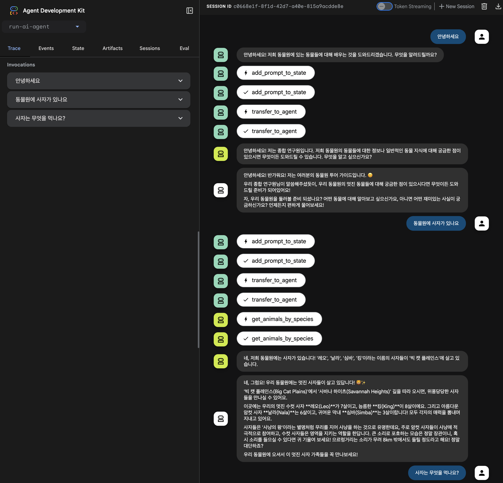

# AI Agent Infrastructure Setup

## Overview

This project provides a comprehensive setup for deploying a sophisticated AI agent on Google Cloud. The agent is designed to be a "Zoo Tour Guide," capable of answering questions about animals in a fictional zoo. It leverages a custom-built MCP (Multi-turn Conversation Platform) server for zoo-specific data and Wikipedia for general knowledge. The entire infrastructure is managed using Terraform, and the agent is deployed on Cloud Run.

## Features

- **AI Agent:** A conversational AI agent built with the Google ADK (Agent Development Kit).
- **MCP Server:** A custom MCP server built with FastAPI that provides data about the zoo's animals. This server is deployed on Cloud Run and is only accessible from within the project's VPC.
- **Terraform Automation:** The entire Google Cloud infrastructure is provisioned using Terraform.
- **Cloud Run Deployment:** Both the AI agent and the MCP server are deployed as serverless applications on Cloud Run.
- **Secure Communication:** The agent communicates securely with the MCP server using ID tokens.

## Architecture

The project consists of three main components:

1.  **Zoo MCP Server:** A Python server that exposes a set of tools for querying information about the zoo's animals. This server is deployed on Cloud Run and is only accessible from within the project's VPC.
2.  **AI Agent:** A Python application that uses the Google ADK to create a multi-agent system. The agent can reason about when to use the MCP server for zoo-specific data and when to use Wikipedia for general knowledge. The agent is also deployed on Cloud Run.
3.  **Terraform:** A set of Terraform scripts that define and provision all the necessary Google Cloud resources, including the VPC, subnets, service accounts, and API enablement.

## Terraform Resources

The following resources are created by Terraform:

- **google_project_service:** Enables necessary Google Cloud APIs for the project, including Cloud Run, Vertex AI, and more.
- **google_service_account:** Creates a dedicated service account for the Cloud Run services to interact with other Google Cloud services securely.
- **google_project_iam_member:** Assigns necessary IAM roles to the service accounts, granting permissions to access resources like AI Platform and Cloud Build.

- **google_compute_network:** Creates a custom Virtual Private Cloud (VPC) network to provide a secure and isolated environment for the services.
- **google_compute_subnetwork:** Creates a subnetwork within the VPC to allocate a range of IP addresses for the resources.

- **google_compute_router:** Creates a Cloud Router to manage dynamic routing for the VPC network.
- **google_compute_router_nat:** Creates a Cloud NAT gateway to allow instances without external IP addresses to access the internet.
- **google_compute_global_address:** Reserves a global internal IP address for Private Service Connect (PSC).
- **google_compute_global_forwarding_rule:** Creates a forwarding rule to direct traffic from the reserved IP address to Google APIs via PSC.
- **google_dns_managed_zone:** Creates a private DNS zone to resolve Google API domain names to the PSC endpoint.
- **google_dns_record_set:** Creates DNS records within the private zone to point to the PSC endpoint.

## Getting Started

### Prerequisites

- [Google Agent Development Kit](https://google.github.io/adk-docs/)
- [Terraform](https://learn.hashicorp.com/tutorials/terraform/install-cli)

### Installation

1.  **Set up environment variables:**

    ```bash
    cd run-ai-agent

    export PROJECT_ID=<your-gcp-project-id>
    export PROJECT_NUMBER=$(gcloud projects describe $PROJECT_ID --format="value(projectNumber)")
    export REGION=us-central1
    ```

2.  **Update `terraform.tfvars`:**

    ```bash
    cd terraform && \
    sed -i \
    -e "s/your-gcp-project-id/$PROJECT_ID/" \
    -e "s/your-region/$REGION/" \
    terraform.tfvars
    ```

3.  **Initialize and apply Terraform:**

    ```bash
    terraform init
    terraform plan
    terraform apply
    ```

    Take note of the outputs.
    ```
    Outputs:

    network_name = "run-ai-agent-vpc"
    service_account_account_id = "run-ai-agent-sa"
    subnetwork_name = "run-ai-agent-subnet"
    ```

### Deployment

1.  **Set up environment variables from terraform output**

    ```bash
    cd ..

    export NETWORK_NAME=run-ai-agent-vpc
    export SUBNET_NAME=run-ai-agent-subnet
    export SERVICE_ACCOUNT=run-ai-agent-sa
    ```

2.  **Deploy the Zoo MCP Server:**

    ```bash
    gcloud run deploy zoo-mcp-server \
        --source ./zoo-mcp-server/ \
        --region ${REGION} \
        --service-account ${SERVICE_ACCOUNT} \
        --no-allow-unauthenticated \
        --network=${NETWORK_NAME} \
        --subnet=${SUBNET_NAME} \
        --vpc-egress=all-traffic \
        --ingress internal
    ```

3. Update .env file
    ``` bash
    echo -e "\nMCP_SERVER_URL=https://zoo-mcp-server-${PROJECT_NUMBER}.${REGION}.run.app/mcp/" >> .env
    ```

4.  **Install the Google ADK in local environment:**

    https://google.github.io/adk-docs/get-started/installation/
    ```bash
    python3 -m venv .venv
    source .venv/bin/activate
    pip install google-adk
    ```

5.  **Deploy the AI Agent:**

    ```bash
    # Allow unauthenticated invocations to [zoo-tour-guide] (y/N)?  y
    adk deploy cloud_run \
      --project=${PROJECT_ID} \
      --region=${REGION} \
      --service_name=zoo-tour-guide \
      --with_ui \
      .

    gcloud run services update zoo-tour-guide \
      --region=${REGION} \
      --service-account ${SERVICE_ACCOUNT} \
      --network=${NETWORK_NAME} \
      --subnet=${SUBNET_NAME}  \
      --vpc-egress=all-traffic
    ```

## Usage
https://codelabs.developers.google.com/codelabs/cloud-run/use-mcp-server-on-cloud-run-with-an-adk-agent#8



## References

- [MCP Server Codelab](https://codelabs.developers.google.com/codelabs/cloud-run/how-to-deploy-a-secure-mcp-server-on-cloud-run?hl=ko#6)
- [AI Agent Codelab](https://codelabs.developers.google.com/codelabs/cloud-run/use-mcp-server-on-cloud-run-with-an-adk-agent?hl=ko#0)
